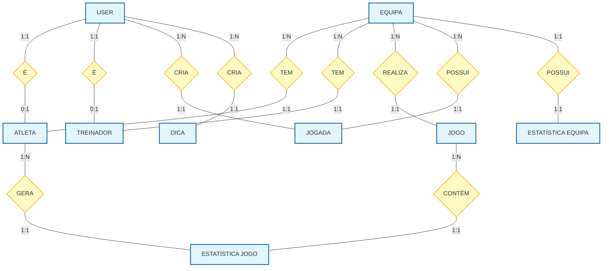

# Diagrama Entidade-Associação (ERD) - Plataforma de Andebol

Este documento descreve a estrutura de dados e as relações entre as entidades da base de dados, com base nas migrações do Laravel.

## Diagrama Visual (Mermaid)



## Relacionamentos Principais

1.  **Users -> Atletas / Treinadores (1:1)**
    *   Um utilizador (`users`) pode ser um `atleta` ou um `treinador`. A tabela `users` guarda o login, e as tabelas `atletas` e `treinadores` guardam os dados específicos.
    *   *Nota*: Na prática, a implementação atual permite 1:N, mas logicamente um utilizador representa um único perfil ativo.

2.  **Equipas -> Atletas (1:N)**
    *   Uma equipa tem muitos atletas.
    *   Um atleta pertence a uma equipa.

3.  **Equipas -> Jogos (1:N)**
    *   Uma equipa realiza vários jogos ao longo da época.

4.  **Jogos <-> Atletas (N:N via `atleta_jogo_stats`)**
    *   Um jogo tem estatísticas de muitos atletas.
    *   Um atleta tem estatísticas em muitos jogos.
    *   A tabela `atleta_jogo_stats` faz esta ligação, guardando golos, cartões e exclusões por jogo.

---

## Código DBML (para dbdiagram.io)

Se precisares de editar visualmente no [dbdiagram.io](https://dbdiagram.io/), usa este código:

```dbml
Table users {
  id integer [primary key]
  nome varchar
  email varchar [unique]
  tipo enum('atleta', 'treinador')
  equipa varchar
  created_at timestamp
}

Table equipas {
  id integer [primary key]
  nome varchar
  escalao_equipa_escalao varchar
}

Table atletas {
  id integer [primary key]
  user_id integer [ref: > users.id]
  equipa_id integer [ref: > equipas.id]
  epoca_id integer
  posicao varchar
  numero integer
  escalao varchar
  cipa integer
}

Table treinadores {
  id integer [primary key]
  user_id integer [ref: > users.id]
  equipa_id integer [ref: > equipas.id]
  epoca_id integer
}

Table jogos {
  id integer [primary key]
  equipa_id integer [ref: > equipas.id]
  adversario varchar
  golos_marcados integer
  golos_sofridos integer
  data_jogo date
}

Table atleta_jogo_stats {
  id integer [primary key]
  atleta_id integer [ref: > atletas.id]
  jogo_id integer [ref: > jogos.id]
  golos integer
  amarelo integer
  vermelho integer
  dois_minutos integer
}

Table jogadas {
  id integer [primary key]
  equipa_id integer [ref: > equipas.id]
  user_id integer [ref: > users.id]
  titulo varchar
  ficheiro varchar
}

Table dicas {
  id integer [primary key]
  user_id integer [ref: > users.id]
  titulo varchar
  categoria enum
}

Table estatistica_equipas {
  id integer [primary key]
  equipa_id integer [ref: > equipas.id]
  escalao varchar
  total_golos_marcados integer
  total_golos_sofridos integer
}
```
